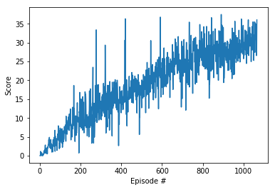

# Project 2: Continous Control

### Introduction

This project is designed to train an agent using deep reinforcement learning through deep Q network. I worked on the first version of the project which the goal of the agent is to move and follow the target location for as long as possible. A reward of +0.1 is provided for each step that the agent's hand is in the goal location. Thus, the goal of your agent is to maintain its position at the target location for as many time steps as possible. The observation space consists of 33 variables corresponding to position, rotation, velocity, and angular velocities of the arm. Each action is a vector with four numbers, corresponding to torque applicable to two joints. Every entry in the action vector should be a number between -1 and 1.

### Implementation

DQN algorithm, experience replay, action noise, DDPG (Deep Deterministic Policy Gradient), actor critic methods were used to solve this problem. The code base architect outline is from [DDPG-Bipedal Udacity project repo](https://github.com/udacity/deep-reinforcement-learning/tree/master/ddpg-bipedal).

### Hyperparameters
Tested different combinations, values below will allow the agent to solve the problem faster.

Hyperparameter | Value
--- | ---
Buffer size | 1e6    
Batch size | 128
Gamma | 0.99
τ | 1e-3
LR-actor | 1e-4
LR-actor | 1e-4

### DQN structure

Both the actor and critic nerual network contains 2 fully connected layer with 256 and 128 inputs, the relu and tanh activation functions are used. The state space is 33 and action space is 4.

The basic structure is from model.py in  [DDPG-Bipedal Udacity project repo](https://github.com/udacity/deep-reinforcement-learning/tree/master/ddpg-bipedal).

### Results
Below is the number of episodes needed to solve the environment for DDPG actor critic

Environment solved in 966 episodes!	Average Score: 30.04

 

### Ideas for future improvements
1. Add a LSTM layer to the network because each state could be moving to different directions

2. Implement A3C for better performance

3. Add Proximal Policy Optimization (PPO) for better learning rate correction

4. Distributed Distributional Deterministic Policy Gradients (D4PG) could be implemented.

5. Better performance platforms. I have tested AWS p2.xlarge instance for graphic computing and Udacity GPU mode, I am not seeing much speed improvements compare to CPU, there maybe some bottleneck like data transfer speed limitation.

6. Udacity work space lost connect after computer inactive for about an hour, AWS connection will lost if computer sleep or wifi lost, it will be better to preserve the training progress for the third party computing resources 

